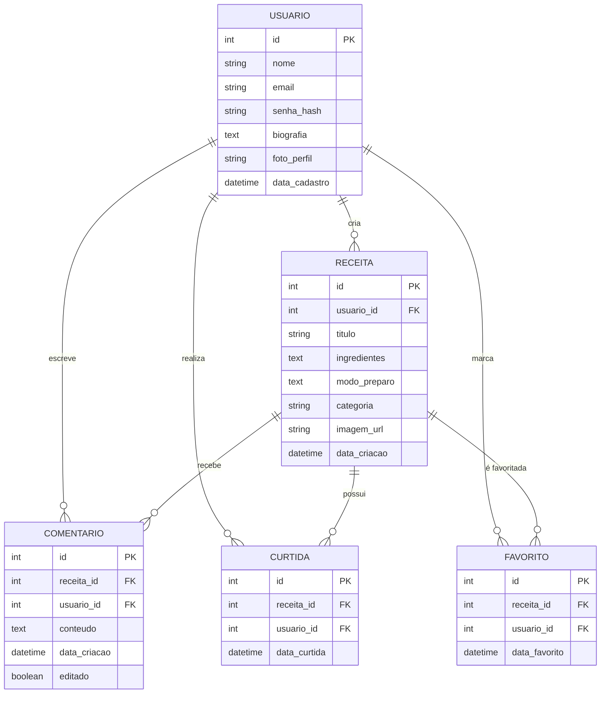
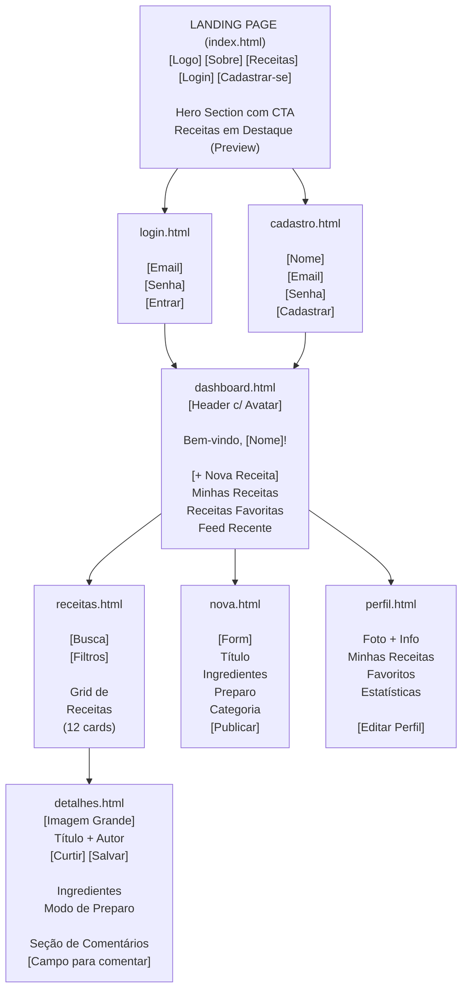

# Product Requirements Document (PRD) - SaborConnect

**Autor: Antonio Claudino S. Neto** - Matrícula: 2019004509

**Versão:** 1.0

**Data:** Outubro de 2025

## 1.1. Visão Geral do Produto

### Nome do Produto

**SaborConnect** - Conectando pessoas através da gastronomia

### Resumo Executivo

O SaborConnect é uma plataforma social dedicada à gastronomia que visa conectar entusiastas da culinária, desde iniciantes até chefs experientes, em um ambiente colaborativo e inspirador. A plataforma permite que usuários compartilhem suas receitas favoritas, descubram novos pratos, interajam através de comentários e construam uma comunidade gastronômica vibrante.

Em um cenário onde as receitas estão dispersas em blogs, sites diversos e cadernos de papel, o SaborConnect centraliza todo esse conhecimento culinário em um único lugar, facilitando o acesso, a organização e o compartilhamento. A plataforma não é apenas um repositório de receitas, mas uma rede social onde cada prato conta uma história e cada cozinheiro pode ser uma estrela.

O diferencial do SaborConnect está na sua abordagem comunitária, permitindo que usuários não apenas consumam conteúdo, mas contribuam ativamente, avaliem receitas, salvem suas favoritas e construam conexões genuínas através da paixão compartilhada pela culinária.

### Objetivos do Produto

- Criar um ecossistema digital colaborativo para compartilhamento de receitas culinárias
- Facilitar a descoberta de novas receitas através de busca inteligente e categorização eficiente
- Promover interação social entre entusiastas da gastronomia através de curtidas, comentários e compartilhamentos
- Democratizar o conhecimento culinário, permitindo que qualquer pessoa compartilhe suas criações
- Construir uma comunidade engajada e ativa de apaixonados por gastronomia
- Preservar receitas tradicionais e familiares através do compartilhamento digital

## 1.2. Problema e Oportunidade

### Contexto

A gastronomia digital passou por uma transformação significativa nos últimos anos. Com o crescimento das redes sociais, milhões de pessoas compartilham fotos de seus pratos, mas falta uma plataforma dedicada que combine aspectos sociais com funcionalidades práticas para cozinheiros. Blogs pessoais, vídeos no YouTube e posts no Instagram fragmentam o conhecimento culinário, dificultando a organização e o acesso sistemático a receitas confiáveis.

Segundo pesquisas recentes, 73% das pessoas buscam receitas online antes de cozinhar, mas 58% relatam frustração ao tentar encontrar receitas específicas ou ao lidar com sites sobrecarregados de anúncios e histórias longas antes da receita propriamente dita.

### Problema

Os principais desafios identificados incluem:

1. **Fragmentação de conteúdo:** Receitas espalhadas em múltiplas plataformas sem padronização
2. **Dificuldade de organização:** Usuários não conseguem salvar e categorizar receitas favoritas facilmente
3. **Falta de confiabilidade:** Ausência de sistema de avaliação e feedback da comunidade
4. **Experiência poluída:** Sites com excesso de propaganda e conteúdo irrelevante
5. **Baixa interação:** Pouca possibilidade de compartilhar experiências e adaptações de receitas
6. **Perda de receitas familiares:** Receitas tradicionais se perdendo por falta de registro digital

### Solução Proposta

O SaborConnect resolve esses problemas através de uma plataforma unificada que oferece:

- Interface limpa e focada no conteúdo culinário
- Sistema robusto de busca e categorização de receitas
- Funcionalidades sociais integradas (curtidas, comentários, compartilhamentos)
- Perfil personalizado onde usuários podem salvar e organizar receitas favoritas
- Sistema de avaliação comunitário para garantir qualidade
- Formato padronizado de receitas facilitando leitura e execução
- Espaço dedicado para preservação de receitas familiares e tradicionais

### Público-Alvo

### Persona 1: Ana Paula, a Entusiasta Doméstica

- **Idade:** 34 anos
- **Ocupação:** Designer gráfica
- **Contexto:** Mãe de dois filhos, trabalha em home office
- **Objetivos:** Encontrar receitas práticas e saudáveis para o dia a dia familiar, variar o cardápio semanal
- **Frustrações:** Pouco tempo para cozinhar, dificuldade em encontrar receitas confiáveis rapidamente
- **Comportamento digital:** Ativa nas redes sociais, usa smartphone para tudo
- **Motivação para usar:** Quer organizar suas receitas favoritas e descobrir opções rápidas e nutritivas

### Persona 2: Carlos Eduardo, o Chef Amador

- **Idade:** 28 anos
- **Ocupação:** Engenheiro de software
- **Contexto:** Solteiro, mora sozinho, cozinhar é seu hobby
- **Objetivos:** Compartilhar suas criações culinárias, receber feedback, aprender técnicas avançadas
- **Frustrações:** Falta de espaço para mostrar suas receitas autorais, baixa interação em blogs pessoais
- **Comportamento digital:** Early adopter, participa de comunidades online
- **Motivação para usar:** Construir reputação como cozinheiro amador e conectar com outros entusiastas

## 1.3. Escopo do Produto

### Incluído no MVP (Versão 1.0)

**Gerenciamento de Usuários:**

- Cadastro de novos usuários com validação de e-mail
- Login e autenticação segura
- Perfil de usuário com foto, biografia e receitas publicadas
- Edição de dados pessoais

**Gerenciamento de Receitas:**

- Criação de receitas com título, ingredientes, modo de preparo e foto
- Edição e exclusão de receitas próprias
- Categorização por tipo de prato (entrada, prato principal, sobremesa, etc.)
- Upload de imagens das receitas

**Funcionalidades Sociais:**

- Sistema de curtidas em receitas
- Comentários em receitas
- Salvamento de receitas favoritas
- Visualização de receitas populares

**Busca e Descoberta:**

- Busca por palavra-chave no título e ingredientes
- Filtro por categoria
- Feed de receitas mais recentes
- Página de receitas populares

**Interface e Navegação:**

- Landing page atrativa
- Dashboard personalizado do usuário
- Listagem de receitas com paginação
- Página de detalhes de receita completa

### Fora do Escopo (Versões Futuras)

- Sistema de vídeos e tutoriais em vídeo
- Ranking de chefs e sistema de badges
- Integração com inteligência artificial para sugestões personalizadas
- Calculadora nutricional automática
- Sistema de seguir outros usuários
- Feed personalizado baseado em preferências
- Modo offline/aplicativo mobile nativo
- Integração com assistentes virtuais (Alexa, Google Home)
- Sistema de lista de compras integrada
- Planejador de cardápio semanal
- Conversão automática de medidas
- Funcionalidade de receitas privadas
- Sistema de monetização para chefs

## 1.4. Requisitos Funcionais

**[Alta] RF01:** O sistema deve permitir que novos usuários criem uma conta fornecendo nome completo, endereço de e-mail válido e senha segura (mínimo 8 caracteres).

**[Alta] RF02:** O sistema deve autenticar usuários cadastrados através de e-mail e senha, gerando uma sessão segura após login bem-sucedido.

**[Alta] RF03:** O sistema deve permitir que usuários autenticados criem receitas informando título, lista de ingredientes, modo de preparo, tempo de preparo, rendimento e categoria.

**[Alta] RF04:** O sistema deve permitir upload de uma imagem principal para cada receita, com tamanho máximo de 5MB e formatos JPG, PNG ou WebP.

**[Média] RF05:** O sistema deve permitir que usuários editem receitas criadas por eles, alterando qualquer campo exceto o autor e data de criação.

**[Média] RF06:** O sistema deve permitir que usuários excluam suas próprias receitas, removendo também todos os comentários e curtidas associados.

**[Alta] RF07:** O sistema deve exibir uma listagem de receitas com imagem, título, autor e número de curtidas, com paginação de 12 receitas por página.

**[Alta] RF08:** O sistema deve permitir que usuários autenticados curtam receitas, sendo possível descurtir posteriormente, com contador em tempo real.

**[Média] RF09:** O sistema deve permitir que usuários autenticados comentem em receitas, exibindo nome do autor, data/hora e conteúdo do comentário.

**[Alta] RF10:** O sistema deve permitir que usuários autenticados salvem receitas como favoritas, criando uma coleção pessoal acessível através do perfil.

**[Média] RF11:** O sistema deve implementar busca por texto que procura correspondências no título, ingredientes e categoria das receitas.

**[Média] RF12:** O sistema deve permitir filtrar receitas por categoria (entradas, pratos principais, sobremesas, bebidas, lanches).

**[Baixa] RF13:** O sistema deve exibir um ranking de receitas mais curtidas na página inicial ou seção específica.

**[Média] RF14:** O sistema deve permitir que usuários visualizem perfis de outros usuários, mostrando suas receitas publicadas e informações básicas.

**[Baixa] RF15:** O sistema deve enviar notificação por e-mail quando uma receita do usuário receber comentários (opcional nas configurações).

## 1.5. Requisitos Não Funcionais

### Usabilidade

**RNF01:** A interface deve ser intuitiva, permitindo que usuários sem experiência técnica consigam publicar uma receita em menos de 5 minutos.

**RNF02:** O sistema deve seguir princípios de design responsivo, adaptando-se automaticamente a dispositivos móveis, tablets e desktops.

**RNF03:** Formulários devem fornecer feedback visual claro sobre erros de validação, indicando exatamente qual campo precisa ser corrigido.

### Performance

**RNF04:** A página inicial deve carregar completamente em menos de 3 segundos em conexões de internet de velocidade média (4G).

**RNF05:** A busca de receitas deve retornar resultados em menos de 2 segundos, mesmo com banco de dados contendo mais de 10.000 receitas.

**RNF06:** Imagens devem ser otimizadas automaticamente para diferentes tamanhos de tela, reduzindo tempo de carregamento.

### Segurança

**RNF07:** Senhas devem ser armazenadas utilizando algoritmo de hash seguro (bcrypt ou Argon2) com salt único por usuário.

**RNF08:** O sistema deve implementar proteção contra ataques CSRF (Cross-Site Request Forgery) em todas as operações que modificam dados.

**RNF09:** Uploads de arquivos devem ser validados quanto ao tipo e escaneados para prevenir upload de arquivos maliciosos.

### Compatibilidade

**RNF10:** O sistema deve ser compatível com as últimas duas versões dos principais navegadores: Chrome, Firefox, Safari e Edge.

**RNF11:** A interface deve funcionar corretamente em dispositivos com resolução mínima de 320px de largura (smartphones compactos).

### Responsividade

**RNF12:** O layout deve adaptar-se automaticamente a três breakpoints principais: mobile (< 768px), tablet (768px - 1024px) e desktop (> 1024px).

**RNF13:** Elementos interativos (botões, links) devem ter área mínima de toque de 44x44 pixels em dispositivos móveis para facilitar interação.

## 1.6. Regras de Negócio

**RN01:** Apenas usuários autenticados podem publicar, editar, excluir, curtir, comentar e salvar receitas. Visitantes podem apenas visualizar conteúdo público.

**RN02:** Receitas devem obrigatoriamente conter título (mínimo 5 caracteres), lista de ingredientes (mínimo 2 itens), modo de preparo (mínimo 50 caracteres) e categoria.

**RN03:** Usuários podem editar ou excluir apenas receitas criadas por eles mesmos. Não é possível modificar receitas de outros usuários.

**RN04:** Cada usuário pode curtir uma receita apenas uma vez. Curtir novamente remove a curtida anterior (toggle).

**RN05:** Comentários podem ser editados pelo autor em até 15 minutos após publicação. Após esse período, apenas exclusão é permitida.

**RN06:** Receitas excluídas são removidas permanentemente do sistema após 30 dias, permitindo recuperação acidental nesse período.

**RN07:** E-mails devem ser únicos no sistema. Não é permitido cadastrar duas contas com o mesmo endereço de e-mail.

**RN08:** Imagens de receitas devem ter tamanho máximo de 5MB e dimensões recomendadas de 1200x800 pixels para otimização.

**RN09:** Usuários não podem comentar mais de 10 vezes na mesma receita em um período de 24 horas (prevenção de spam).

**RN10:** Títulos de receitas devem ser únicos para o mesmo usuário, mas usuários diferentes podem ter receitas com títulos iguais.

## 1.7. Casos de Uso

### UC01 - Cadastrar Receita

**Ator principal:** Usuário autenticado

**Pré-condições:**

- Usuário deve estar logado no sistema
- Usuário deve ter acesso ao formulário de nova receita

**Fluxo principal:**

1. Usuário acessa a página "Nova Receita" através do menu ou dashboard
2. Sistema exibe formulário com campos: título, ingredientes, modo de preparo, tempo de preparo, rendimento, categoria e upload de imagem
3. Usuário preenche título da receita (ex: "Bolo de Chocolate Cremoso")
4. Usuário adiciona ingredientes um por um ou em formato de lista
5. Usuário descreve passo a passo do modo de preparo
6. Usuário informa tempo de preparo e rendimento
7. Usuário seleciona categoria apropriada
8. Usuário faz upload de foto do prato
9. Usuário clica no botão "Publicar Receita"
10. Sistema valida todos os campos obrigatórios
11. Sistema salva a receita no banco de dados
12. Sistema redireciona para a página de detalhes da receita criada
13. Sistema exibe mensagem de sucesso

**Fluxo alternativo 1 - Campos obrigatórios não preenchidos:**

- No passo 10, se algum campo obrigatório estiver vazio ou inválido
- Sistema exibe mensagens de erro específicas para cada campo
- Sistema mantém os dados já preenchidos no formulário
- Usuário corrige os erros e tenta novamente

**Fluxo alternativo 2 - Erro no upload da imagem:**

- No passo 8, se a imagem exceder 5MB ou formato for inválido
- Sistema exibe mensagem de erro sobre requisitos da imagem
- Usuário seleciona outra imagem que atenda aos requisitos

**Pós-condição:** Receita é criada e fica disponível publicamente para todos os usuários

### UC02 - Buscar Receita

**Ator principal:** Qualquer usuário (autenticado ou visitante)

**Pré-condições:** Sistema deve ter receitas cadastradas

**Fluxo principal:**

1. Usuário acessa a página de receitas ou campo de busca no cabeçalho
2. Usuário digita palavra-chave na barra de busca (ex: "frango")
3. Usuário pressiona Enter ou clica no botão de busca
4. Sistema busca correspondências no título, ingredientes e categorias
5. Sistema exibe lista de receitas que correspondem à busca
6. Usuário visualiza resultados com foto, título e autor
7. Usuário clica em uma receita para ver detalhes completos

**Fluxo alternativo 1 - Nenhum resultado encontrado:**

- No passo 5, se nenhuma receita corresponder à busca
- Sistema exibe mensagem "Nenhuma receita encontrada para sua busca"
- Sistema sugere buscar por termos mais genéricos
- Sistema pode exibir receitas populares como sugestão

**Fluxo alternativo 2 - Uso de filtros:**

- No passo 2, usuário aplica filtros de categoria além da palavra-chave
- Sistema combina busca textual com filtro de categoria
- Resultados são refinados conforme critérios selecionados

**Pós-condição:** Usuário visualiza lista de receitas relevantes ou mensagem informando ausência de resultados

### UC03 - Curtir Receita

**Ator principal:** Usuário autenticado

**Pré-condições:**

- Usuário deve estar logado
- Usuário deve estar visualizando uma receita

**Fluxo principal:**

1. Usuário acessa página de detalhes de uma receita
2. Sistema exibe botão de curtir (ícone de coração) com contador
3. Usuário clica no botão de curtir
4. Sistema registra a curtida no banco de dados
5. Sistema incrementa o contador de curtidas em +1
6. Sistema muda estado visual do botão (coração preenchido)
7. Sistema pode enviar notificação ao autor da receita

**Fluxo alternativo 1 - Descurtir receita:**

- No passo 3, se usuário já havia curtido anteriormente
- Sistema remove a curtida do banco de dados
- Sistema decrementa o contador em -1
- Sistema retorna botão ao estado não curtido (coração vazio)

**Fluxo alternativo 2 - Usuário não autenticado tenta curtir:**

- No passo 3, se usuário não estiver logado
- Sistema exibe modal solicitando login ou cadastro
- Usuário pode fazer login e receita permanece carregada
- Após login, usuário pode curtir a receita

**Pós-condição:** Curtida é registrada ou removida, contador atualizado e estado visual modificado

### UC04 - Comentar em Receita

**Ator principal:** Usuário autenticado

**Pré-condições:**

- Usuário deve estar logado
- Receita deve existir e estar pública

**Fluxo principal:**

1. Usuário acessa página de detalhes da receita
2. Usuário rola até a seção de comentários
3. Sistema exibe campo de texto para novo comentário
4. Usuário digita seu comentário (ex: "Fiz ontem e ficou maravilhoso!")
5. Usuário clica em "Publicar Comentário"
6. Sistema valida comprimento mínimo do comentário (10 caracteres)
7. Sistema salva comentário associado à receita e ao usuário
8. Sistema exibe o comentário imediatamente na lista
9. Sistema pode notificar o autor da receita por e-mail

**Fluxo alternativo 1 - Comentário muito curto:**

- No passo 6, se comentário tiver menos de 10 caracteres
- Sistema exibe mensagem "Comentário deve ter no mínimo 10 caracteres"
- Usuário expande o comentário e tenta novamente

**Fluxo alternativo 2 - Editar comentário:**

- Usuário pode clicar em "Editar" em seu próprio comentário (até 15 min)
- Sistema exibe campo de texto com conteúdo atual
- Usuário modifica texto e salva
- Sistema atualiza comentário com marcação "(editado)"

**Pós-condição:** Comentário é publicado e visível para todos os usuários que acessarem a receita

### UC05 - Salvar Receita como Favorita

**Ator principal:** Usuário autenticado

**Pré-condições:**

- Usuário deve estar logado
- Receita deve estar disponível

**Fluxo principal:**

1. Usuário visualiza uma receita que deseja salvar
2. Sistema exibe botão "Salvar" ou ícone de bookmark
3. Usuário clica no botão de salvar
4. Sistema adiciona receita à lista de favoritos do usuário
5. Sistema muda estado visual do botão (bookmark preenchido)
6. Sistema exibe mensagem "Receita salva nos favoritos"
7. Receita aparece na seção "Minhas Receitas Favoritas" do perfil

**Fluxo alternativo 1 - Remover dos favoritos:**

- No passo 3, se receita já estava salva
- Sistema remove receita dos favoritos
- Sistema atualiza estado visual (bookmark vazio)
- Sistema exibe mensagem "Receita removida dos favoritos"

**Fluxo alternativo 2 - Acessar favoritos:**

- Usuário acessa seu perfil
- Navega até aba "Favoritos"
- Sistema lista todas receitas salvas
- Usuário pode acessar qualquer receita salva com um clique

**Pós-condição:** Receita é adicionada ou removida da lista de favoritos do usuário

### UC06 - Editar Perfil de Usuário

**Ator principal:** Usuário autenticado

**Pré-condições:** Usuário deve estar logado

**Fluxo principal:**

1. Usuário acessa seu perfil clicando no avatar no menu
2. Sistema exibe informações atuais do perfil
3. Usuário clica em botão "Editar Perfil"
4. Sistema exibe formulário com campos editáveis: nome, biografia, foto de perfil
5. Usuário modifica informações desejadas
6. Usuário pode fazer upload de nova foto de perfil
7. Usuário clica em "Salvar Alterações"
8. Sistema valida dados fornecidos
9. Sistema atualiza informações no banco de dados
10. Sistema exibe mensagem de sucesso
11. Perfil atualizado é exibido

**Fluxo alternativo 1 - Cancelar edição:**

- No passo 7, usuário clica em "Cancelar"
- Sistema descarta alterações não salvas
- Sistema retorna à visualização do perfil sem modificações

**Fluxo alternativo 2 - Erro na validação:**

- No passo 8, se dados forem inválidos (ex: biografia muito longa)
- Sistema exibe mensagens de erro específicas
- Usuário corrige e tenta salvar novamente

**Pós-condição:** Informações do perfil são atualizadas e visíveis para o usuário e outros membros da plataforma

## 1.8. Modelagem de Dados (Conceitual)

### Entidades e Atributos

**Usuário (Usuario)**

- id (PK, INT, AUTO_INCREMENT)
- nome (VARCHAR 100, NOT NULL)
- email (VARCHAR 150, UNIQUE, NOT NULL)
- senha_hash (VARCHAR 255, NOT NULL)
- biografia (TEXT, NULL)
- foto_perfil (VARCHAR 255, NULL)
- data_cadastro (DATETIME, DEFAULT CURRENT_TIMESTAMP)
- ativo (BOOLEAN, DEFAULT TRUE)

**Receita (Receita)**

- id (PK, INT, AUTO_INCREMENT)
- usuario_id (FK → Usuario.id, NOT NULL)
- titulo (VARCHAR 200, NOT NULL)
- descricao_curta (VARCHAR 500, NULL)
- ingredientes (TEXT, NOT NULL)
- modo_preparo (TEXT, NOT NULL)
- tempo_preparo (INT, NULL) // em minutos
- rendimento (VARCHAR 50, NULL)
- categoria (ENUM: 'entrada', 'prato_principal', 'sobremesa', 'bebida', 'lanche', NOT NULL)
- imagem_url (VARCHAR 255, NULL)
- visualizacoes (INT, DEFAULT 0)
- data_criacao (DATETIME, DEFAULT CURRENT_TIMESTAMP)
- data_atualizacao (DATETIME, ON UPDATE CURRENT_TIMESTAMP)
- ativa (BOOLEAN, DEFAULT TRUE)

**Comentário (Comentario)**

- id (PK, INT, AUTO_INCREMENT)
- receita_id (FK → Receita.id, NOT NULL)
- usuario_id (FK → Usuario.id, NOT NULL)
- conteudo (TEXT, NOT NULL)
- data_criacao (DATETIME, DEFAULT CURRENT_TIMESTAMP)
- data_edicao (DATETIME, NULL)
- editado (BOOLEAN, DEFAULT FALSE)

**Curtida (Curtida)**

- id (PK, INT, AUTO_INCREMENT)
- receita_id (FK → Receita.id, NOT NULL)
- usuario_id (FK → Usuario.id, NOT NULL)
- data_curtida (DATETIME, DEFAULT CURRENT_TIMESTAMP)
- UNIQUE (receita_id, usuario_id) // Garante que usuário curte apenas uma vez

**Favorito (Favorito)**

- id (PK, INT, AUTO_INCREMENT)
- receita_id (FK → Receita.id, NOT NULL)
- usuario_id (FK → Usuario.id, NOT NULL)
- data_favoritado (DATETIME, DEFAULT CURRENT_TIMESTAMP)
- UNIQUE (receita_id, usuario_id) // Usuário não pode favoritar mesma receita duas vezes

### Relacionamentos

**Usuario ↔ Receita (1:N)**

- Um usuário pode criar várias receitas
- Cada receita pertence a um único usuário (autor)
- Relacionamento: Usuario.id → Receita.usuario_id
- Cardinalidade: 1 usuário para N receitas

**Usuario ↔ Comentario (1:N)**

- Um usuário pode fazer vários comentários
- Cada comentário pertence a um único usuário
- Relacionamento: Usuario.id → Comentario.usuario_id
- Cardinalidade: 1 usuário para N comentários

**Receita ↔ Comentario (1:N)**

- Uma receita pode ter vários comentários
- Cada comentário está associado a uma única receita
- Relacionamento: Receita.id → Comentario.receita_id
- Cardinalidade: 1 receita para N comentários

**Usuario ↔ Curtida ↔ Receita (N:M)**

- Um usuário pode curtir várias receitas
- Uma receita pode ser curtida por vários usuários
- Tabela associativa: Curtida
- Relacionamentos: Usuario.id → Curtida.usuario_id e Receita.id → Curtida.receita_id
- Cardinalidade: N usuários para M receitas

**Usuario ↔ Favorito ↔ Receita (N:M)**

- Um usuário pode favoritar várias receitas
- Uma receita pode ser favoritada por vários usuários
- Tabela associativa: Favorito
- Relacionamentos: Usuario.id → Favorito.usuario_id e Receita.id → Favorito.receita_id
- Cardinalidade: N usuários para M receitas

### Diagrama Textual

## 1.9. User Stories (Histórias de Usuário)

**US01 - Descoberta de Receitas**

Como visitante não cadastrado, quero visualizar receitas populares e recentes na página inicial para me inspirar a cozinhar algo novo e decidir se quero me cadastrar na plataforma.

**Critérios de Aceitação:**

- Página inicial exibe no mínimo 12 receitas com imagem e título
- Receitas podem ser ordenadas por "Mais Recentes" ou "Mais Curtidas"
- Ao clicar em uma receita, sou direcionado aos detalhes completos
- Não preciso estar logado para visualizar receitas

**US02 - Salvamento de Favoritos**

Como usuário cadastrado, quero salvar minhas receitas favoritas em uma coleção pessoal para acessá-las rapidamente sempre que precisar sem ter que buscá-las novamente.

**Critérios de Aceitação:**

- Botão de "Salvar" visível em cada receita
- Ao clicar, receita é adicionada aos meus favoritos instantaneamente
- Posso acessar lista de favoritos através do meu perfil
- Posso remover receitas dos favoritos a qualquer momento
- Contador indica quantas receitas tenho salvas

**US03 - Publicação de Receita Própria**

Como usuário autenticado, quero criar e publicar minhas próprias receitas com ingredientes, modo de preparo e foto para compartilhar meu conhecimento culinário com a comunidade.

**Critérios de Aceitação:**

- Formulário intuitivo com campos claramente identificados
- Possibilidade de adicionar múltiplos ingredientes
- Upload de foto com preview antes de publicar
- Validação de campos obrigatórios com mensagens claras
- Após publicação, sou redirecionado para ver minha receita publicada

**US04 - Gestão de Receitas Próprias**

Como autor de receitas, quero editar e excluir minhas receitas publicadas para mantê-las atualizadas, corrigir erros ou remover conteúdo que não desejo mais compartilhar.

**Critérios de Aceitação:**

- Botões de "Editar" e "Excluir" visíveis apenas nas minhas receitas
- Ao editar, formulário é preenchido com dados atuais
- Confirmação antes de excluir para evitar remoções acidentais
- Histórico de edição registrado (data de última atualização)
- Não posso editar ou excluir receitas de outros usuários

**US05 - Interação Social**

Como membro da comunidade, quero curtir e comentar em receitas de outros usuários para demonstrar apreciação, fazer perguntas e compartilhar minha experiência ao preparar o prato.

**Critérios de Aceitação:**

- Botão de curtir com feedback visual imediato
- Campo de comentário acessível e fácil de usar
- Meus comentários aparecem com meu nome e foto de perfil
- Posso editar meus comentários por tempo limitado
- Contador de curtidas e número de comentários visíveis

**US06 - Busca Eficiente**

Como usuário com necessidade específica, quero buscar receitas por ingredientes ou tipo de prato para encontrar exatamente o que preciso preparar sem navegar por dezenas de receitas irrelevantes.

**Critérios de Aceitação:**

- Campo de busca visível em todas as páginas
- Busca retorna resultados relevantes em menos de 2 segundos
- Posso filtrar por categoria (sobremesa, prato principal, etc.)
- Resultados mostram por que a receita foi encontrada (ingrediente correspondente)
- Mensagem clara quando nenhum resultado é encontrado

**US07 - Perfil Personalizado**

Como usuário ativo, quero ter um perfil personalizado com minhas informações, foto e lista de receitas publicadas para construir minha identidade na plataforma e ser reconhecido pela comunidade.

**Critérios de Aceitação:**

- Posso adicionar foto de perfil e biografia
- Meu perfil exibe todas as receitas que publiquei
- Estatísticas visíveis (total de receitas, curtidas recebidas)
- Outros usuários podem visualizar meu perfil público
- Posso editar minhas informações a qualquer momento

**US08 - Cadastro Simples**

Como novo visitante interessado, quero me cadastrar rapidamente na plataforma fornecendo apenas informações essenciais para começar a usar o sistema sem burocracia.

**Critérios de Aceitação:**

- Formulário com apenas 3 campos: nome, email e senha
- Validação em tempo real dos campos
- Mensagens de erro específicas e úteis
- Confirmação visual de cadastro bem-sucedido
- Redirecionamento automático para dashboard após cadastro

## 1.10. Wireframes / Fluxo de Navegação

### Estrutura de Navegação

### Descrição Detalhada das Telas

**1. Landing Page (index.html)**

- **Header:** Logo SaborConnect à esquerda, menu de navegação (Sobre, Receitas, Login, Cadastrar-se)
- **Hero Section:** Imagem de fundo com comida apetitosa, título principal "Compartilhe Sabores, Conecte Pessoas", subtítulo explicativo, CTA "Comece Agora"
- **Seção de Destaques:** Grid 3x4 com as 12 receitas mais curtidas, cada card mostra imagem, título, autor e número de curtidas
- **Seção "Como Funciona":** 3 cards explicando: 1) Cadastre-se, 2) Publique receitas, 3) Conecte-se
- **Footer:** Links para redes sociais, termos de uso, contato

**2. Login (login.html)**

- Layout centralizado com card de login
- Logo no topo
- Campo email e senha
- Botão "Entrar" em destaque
- Link "Esqueci minha senha"
- Divisor com "ou"
- Link "Criar nova conta"

**3. Cadastro (cadastro.html)**

- Similar ao login, porém com campos: Nome completo, Email, Senha, Confirmar senha
- Checkbox "Aceito os termos de uso"
- Botão "Criar Conta"
- Link "Já tenho conta"

**4. Dashboard (dashboard.html)**

- **Header fixo:** Logo, campo de busca, ícones de notificação e avatar do usuário
- **Sidebar:** Links para Dashboard, Minhas Receitas, Favoritos, Nova Receita, Perfil
- **Conteúdo principal:**
  - Mensagem de boas-vindas personalizada
  - Botão destacado "+ Nova Receita"
  - Seção "Minhas Receitas Recentes" (últimas 6)
  - Seção "Feed da Comunidade" (receitas recentes de outros usuários)
  - Cards com imagem, título, data, curtidas

**5. Listagem de Receitas (receitas.html)**

- **Header:** Igual ao dashboard
- **Barra de busca e filtros:** Campo de texto, dropdown de categorias, botão buscar
- **Grid de receitas:** 4 colunas no desktop, 2 no tablet, 1 no mobile
- **Card de receita:** Imagem (proporção 4:3), título, nome do autor com foto pequena, ícones de curtida e comentários com contadores
- **Paginação:** Botões "Anterior" e "Próximo" no rodapé

**6. Detalhes da Receita (detalhes.html)**

- **Header:** Igual ao dashboard
- **Imagem principal:** Full-width, altura 400px
- **Informações principais:** Título (H1), foto e nome do autor, botões "Curtir" e "Salvar nos Favoritos"
- **Metadados:** Tempo de preparo, rendimento, categoria, data de publicação
- **Ingredientes:** Lista com checkbox para marcar conforme usa
- **Modo de Preparo:** Passos numerados, texto claro e espaçado
- **Seção de comentários:**
  - Contador "X comentários"
  - Campo para novo comentário (se logado)
  - Lista de comentários com foto, nome, data e texto

**7. Nova Receita (nova.html)**

- **Header:** Igual ao dashboard
- **Formulário vertical:**
  - Upload de imagem (área de drag-and-drop com preview)
  - Campo "Título da Receita"
  - Campo "Descrição Curta" (opcional)
  - Textarea "Ingredientes" (um por linha)
  - Textarea "Modo de Preparo"
  - Campos numéricos: Tempo de Preparo (minutos), Rendimento
  - Dropdown "Categoria"
  - Botões "Publicar" e "Salvar como Rascunho"

**8. Perfil do Usuário (perfil.html)**

- **Header:** Igual ao dashboard
- **Seção de perfil:**
  - Foto grande do usuário
  - Nome
  - Biografia
  - Estatísticas: Total de receitas, Total de curtidas recebidas, Membro desde
  - Botão "Editar Perfil" (se for o próprio usuário)
- **Abas:**
  - "Minhas Receitas" - Grid com todas as receitas publicadas
  - "Favoritos" - Grid com receitas salvas
- **Grid:** Similar ao de receitas.html

## Conclusão

Este documento apresenta os requisitos completos para o desenvolvimento do **SaborConnect**, uma plataforma social de receitas culinárias que visa democratizar o conhecimento gastronômico e criar uma comunidade engajada de entusiastas da culinária.

O escopo definido para o MVP (versão 1.0) garante funcionalidades essenciais para validação do conceito junto aos usuários, enquanto mantém o desenvolvimento focado e viável. As funcionalidades sociais integradas (curtidas, comentários, favoritos) diferenciam o SaborConnect de simples repositórios de receitas, criando um ambiente verdadeiramente colaborativo.

Os requisitos funcionais e não funcionais foram cuidadosamente elaborados para garantir uma experiência de usuário fluida, segura e agradável. A modelagem de dados proposta suporta todas as funcionalidades descritas e permite escalabilidade futura.

As personas definidas (Ana Paula e Carlos Eduardo) representam os principais segmentos do público-alvo e guiarão decisões de design e priorização de features nas próximas etapas do desenvolvimento.

**Próximos Passos:**

1. Revisão e aprovação do PRD por stakeholders
2. Desenvolvimento do protótipo navegável (HTML/CSS)
3. Testes de usabilidade do protótipo
4. Definição da stack tecnológica para desenvolvimento backend
5. Planejamento de sprints de desenvolvimento
6. Desenvolvimento do MVP
7. Testes beta com grupo selecionado de usuários

**Aprovações:**

---

Product Owner

---

Tech Lead

---

UX/UI Designer
